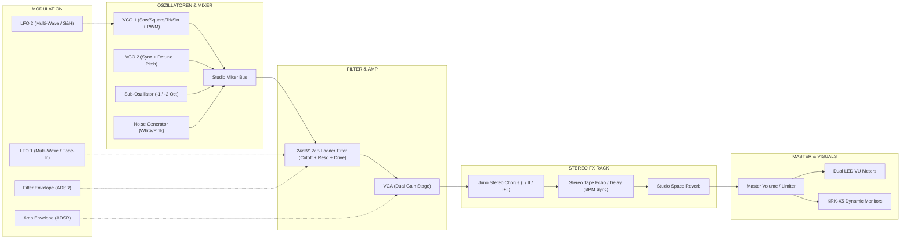

# ⚡ RETROVOX SUB-1 • Analog Web Synthesizer

[](https://developer.mozilla.org/en-US/docs/Web/API/Web_Audio_API)
[](https://developer.mozilla.org/en-US/docs/Web/API/Web_MIDI_API)
[](https://developer.mozilla.org/en-US/docs/Web/JavaScript)
[](#)
[](LICENSE)

> **RETROVOX SUB-1** ist ein vollwertiger, subtraktiver analoger Synthesizer und Sequenzer direkt im Browser. Entwickelt mit nativer **Web Audio API**, **Web MIDI API** und **Vanilla JavaScript/CSS** – ohne externe Frameworks oder Build-Schritte.

---

## 🌟 Highlights

- 🎹 **Vollwertige subtraktive Synthese**: 2 Oszillatoren (VCO 1 & VCO 2) mit Hard-Sync, Detune, PWM, Sub-Oszillator (-1/-2 Oktaven) und Rauschgenerator (White/Pink Noise).
- 🎛️ **Resonantes 24dB/12dB Ladder-Filter (VCF)**: Klassischer Moog-Ladder-Charakter mit Filter-Drive/Saturation, Resonanz-Selbstoszillation, Hüllkurven-Modulation und Key-Tracking.
- ⏱️ **Dual ADSR Hüllkurven**: Getrennte, ultraschnelle analog modellierte Hüllkurven für Filter (VCF) und Lautstärke (VCA).
- 🌊 **Duales LFO Modulationsnetzwerk**: 2 unabhängige LFOs mit Multi-Wellenformen, Sample & Hold, Delay/Fade-In und flexiblem Routing auf Tonhöhe (Pitch), Filter (VCF), Pulsbreite (PWM) und Amplitude (Amp).
- 🚀 **16-Step Arpeggiator & Sequenzer**: Extrem präziser Web-Audio Lookahead-Clock-Scheduler mit 0ms Jitter. Modi: *Up*, *Down*, *Up/Down*, *Random*, *As Played* und *16-Step Pattern Sequenzer* mit programmierbaren Gates, Swing/Groove und Latch/Hold.
- 🎚️ **Vintage FX Studio Rack**:
  - **Roland Juno-Style BBD Stereo Chorus** (Modi: *Off*, *I*, *II*, *I+II*)
  - **Stereo Tape Delay / Echo** mit BPM-Synchronisation, Stereo-Spread und High-Cut Dämpfung
  - **Lush Studio Space Reverb** mit stufenlosem Raum-Decay und Mix
- 🔊 **Interaktives Studio-Erlebnis**:
  - Zwei animierte **KRK-X5 Nahfeldmonitore** mit Bassmembran-Auslenkung in Echtzeit
  - Stereo **LED VU-Meter Cluster**
  - Integriertes **Echtzeit-Oszilloskop** & Filter-Graph
- 🔌 **Web MIDI API Integration**: Plug-and-Play Unterstützung für Hardware-MIDI-Keyboards und Controller inklusive Pitch-Bend, Mod-Wheel und Velocity.
- 💾 **Preset-Verwaltung & Export/Import**: 10 handgefertigte Werks-Presets (Vangelis Blade Runner, Moog Minimoog Bass, Juno-106 Synthwave Pluck, TB-303 Acid Reso, etc.) sowie Speicher- und JSON Export-/Importfunktion für eigene Soundbänke.

---

## 🎧 Sound-Architektur



---

## 🚀 Schnellstart

Das Projekt benötigt **keinen Build-Prozess** und hat **keine externen Abhängigkeiten**.

### Option 1: Direkt im Browser öffnen
Einfach die Datei `index.html` per Doppelklick in einem modernen Webbrowser (Chrome, Edge, Firefox, Brave, Safari) öffnen.

### Option 2: Mit lokalem Webserver
```bash
# Repository klonen
git clone https://github.com/the3ver/websynth.git
cd websynth

# Lokalen Webserver starten (z. B. mit npx serve)
npx serve .

# Oder mit Python:
# python -m http.server 8000
```
Öffne anschließend [http://localhost:3000](http://localhost:3000) (oder den im Terminal angezeigten Port).

---

## 🎹 Tastatur-Steuerung (Computer Keyboard)

Du kannst den Synthesizer direkt über deine Computertastatur spielen:

| Taste | Note | Taste | Note |
| :--- | :--- | :--- | :--- |
| <kbd>A</kbd> / <kbd>Y</kbd> / <kbd>Z</kbd> | C3 | <kbd>W</kbd> | C#3 |
| <kbd>S</kbd> | D3 | <kbd>E</kbd> | D#3 |
| <kbd>D</kbd> | E3 | <kbd>T</kbd> | F#3 |
| <kbd>F</kbd> | F3 | <kbd>Z</kbd> / <kbd>Y</kbd> | G#3 |
| <kbd>G</kbd> | G3 | <kbd>U</kbd> | A#3 |
| <kbd>H</kbd> | A3 | <kbd>O</kbd> | C#4 |
| <kbd>J</kbd> | B3 | <kbd>P</kbd> | D#4 |
| <kbd>K</kbd> | C4 | | |

- **Oktaven umschalten**: <kbd>X</kbd> (Oktave höher), <kbd>Y</kbd> / <kbd>C</kbd> (Oktave tiefer)
- **Sustain / Latch**: Halte Noten mit der Maus oder aktiviere den Arpeggiator-Latch.

---

## 🔌 Hardware Web MIDI Setup

1. Schließe dein USB- oder Bluetooth-MIDI-Keyboard an deinen Computer an.
2. Öffne den **RETROVOX SUB-1** im Browser.
3. Die MIDI-Statusanzeige in der oberen Leiste wechselt automatisch auf `MIDI: 1 DEVICE CONNECTED`.
4. Unterstützte MIDI-Befehle:
   - `Note On` / `Note Off` (mit Velocity-Dynamik)
   - `Pitch Bend` (Wheel / Lever)
   - `Control Change #1` (Modulation Wheel)
   - `Control Change #64` (Sustain Pedal)
   - `All Notes Off` / `Panic`

---

## 💾 Factory Presets

| Nr. | Preset-Name | Kategorie | Beschreibung |
| :--- | :--- | :--- | :--- |
| **01** | `BLADE RUNNER BRASS` | Brass | Epische Vangelis CS-80 Brass mit Filter-Sweep, Juno-Chorus und Space Reverb. |
| **02** | `MOOG MINIMOOG BASS` | Bass | Fetter, druckvoller Moog Ladder Bass mit 24dB Sättigung und Sub-Oktave. |
| **03** | `JUNO-106 SYNTHWAVE PLUCK` | Pluck | Klassischer 80s Roland Arp-Sound mit PWM, BBD Chorus II und Tape Echo. |
| **04** | `TB-303 ACID RESO` | Acid / Lead | Resonante Acid-Bassline mit steilem Filter-Envelope und Glide/Portamento. |
| **05** | `80s JUMP POLY BRASS` | Brass | Ikonischer Oberheim OB-Xa Style Synthesizer-Sound mit detunten Saw-Waves. |
| **06** | `CYBERPUNK DARK BASSLINE` | Bass | Aggressiver, gesättigter Darksynth-Bass mit Noise-Layer und Filter-Drive. |
| **07** | `SCI-FI SAMPLE & HOLD` | FX | Zufallsmodulierter Sample & Hold Soundeffekt aus alten Modular-Synthesizern. |
| **08** | `LUSH ETHEREAL DREAM PAD` | Pad | Schwebende, warme Ambient-Klanglandschaft mit langen Hüllkurven und Hall. |
| **09** | `STRANGER 80s SYNTH THEME` | Arp | Arpeggierter Synthwave-Klassiker mit analogem Drift und Stereo-Delay. |
| **10** | `CRYSTAL DIGITAL CHIMES` | Lead | Brillanter Glockenklang mit hoher Resonanz und subtilem Pitch-Vibrato. |

---

## 📁 Projektstruktur

```
websynth/
├── .github/
│   └── workflows/
│       └── deploy.yml      # Automatische GitHub Pages CI/CD Pipeline
├── css/
│   └── style.css           # Vollständiges High-End Analog-Studio UI & Styling
├── js/
│   ├── app.js              # Initialisierung, Master Controls & Event Wiring
│   ├── arp-engine.js       # 16-Step Arpeggiator & Lookahead-Clock Scheduler
│   ├── audio-engine.js     # Web Audio API Synthese-Engine (VCO, VCF, LFO, FX)
│   ├── presets.js          # Factory Preset Library & State Serializer
│   └── synth-ui.js         # Interaktives UI (Knobs, Slider, Monitor-Animation, MIDI)
├── .gitignore              # Git Ignore Konfiguration
├── index.html              # Synthesizer Studio HTML5 Markup
├── LICENSE                 # MIT Lizenz
├── package.json            # Projekt-Metadaten & Hilfsskripte
└── README.md               # Dokumentation
```

---

## 🛠️ Technologien

- **Web Audio API** (`AudioContext`, `OscillatorNode`, `BiquadFilterNode`, `GainNode`, `WaveShaperNode`, `DelayNode`, `ConvolverNode`, `AnalyserNode`)
- **Web MIDI API** (`navigator.requestMIDIAccess`)
- **Vanilla JavaScript (ES6+)**
- **Modern CSS3** (Custom Properties, Flexbox, Grid, Glassmorphism, CSS Transitions & Keyframes)
- **Google Fonts** (*Chakra Petch*, *Inter*, *JetBrains Mono*)

---

## 📄 Lizenz

Dieses Projekt ist unter der **[MIT Lizenz](LICENSE)** lizenziert – freie Nutzung für private und kommerzielle Zwecke.
