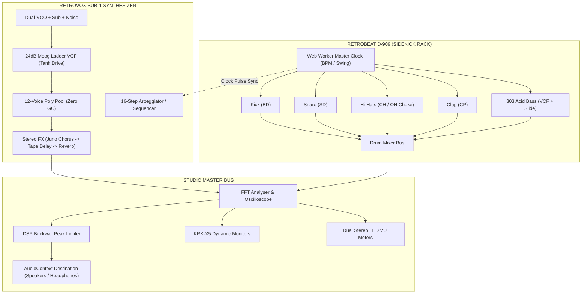

# 🎹 RETROVOX SUB-1 & RETROBEAT D-909 • Analog Synthesizer & Drum Studio

[](#)
[](#)
[](#)
[](#)
[](LICENSE)

Ein authentischer analoger Synthesizer (**RETROVOX SUB-1**) und eine DSP Drum & Acid Bass Machine (**RETROBEAT D-909**) direkt im Webbrowser – gebaut mit modernsten Web-Standards (HTML5, Vanilla CSS, Web Audio API, Web MIDI API, Web Workers).

---

### ⚡ NEU in v1.7.4: Mobile Phone Keyboard & Split Studio Landscape Layout
- **🎹 4. Mobile Tab `[ KEYBED ]`:** Blitzschneller 1-Tap Fokus auf die volle Klaviatur und den 16-Step Arpeggiator ohne langes Scrollen.
- **📱 Split Studio Querformat:** Bei Drehung ins Smartphone-Querformat teilt sich das Chassis in eine 2-Spalten-Ansicht: Links Synth-Regler & Tabs, rechts Klaviatur + Arp – 100% ohne Scrollen mit beiden Händen spielbar.
- **👆 Unblockiertes Touch-Scrolling:** Native Scrollcontainer-Optimierung für geschmeidiges, fehlerfreies Scrollen auf iOS Safari und Chrome Android.

---

## 🌟 Features & Highlights

### ⚡ NEU in v1.4.0: Progressive Web App (PWA) & 100% Offline Studio Engine
- **Installierbare Standalone Desktop- & Mobile-App**: Direkt aus dem Browser installierbar (Windows, macOS, Linux, iOS, Android) mit eigenem App-Fenster, Dock-Icon und schnellen App-Shortcuts (*Synthesizer Lab* & *D-909 Drum Rack*).
- **100% Offline DSP (Zero Network Dependencies)**: Alle Oszillatoren, Filter, Drums und 303-Basslines werden in Echtzeit per DSP berechnet – kein Audio-Streaming oder Sample-Download erforderlich. Funktioniert komplett ohne Internetverbindung im Flugzeug oder auf der Bühne.
- **Service Worker mit High-Performance App Shell & Dynamic Font Cache**: Lokale Speicherung aller Skripte, Stylesheets und Google Webfonts für 0ms Ladezeit.
- **Stage Mode (Screen Wake Lock API)**: Verhindert automatisches Abschalten des Displays während Live-Sessions und Sequenzer-Jams.
- **Safe-Area Inset Support**: Randloses Eintauchen auf Smartphones und Tablets mit Notches.

### 🥁 RETROBEAT D-909 Drum & Bass Machine (Sidekick Unit)
- **Einfahrbares Studio-Rack-Gerät**: Auf Knopfdruck (`Shift+D` oder rechter Seitenreiter) fährt von rechts ein vollwertiger analoger Drumcomputer mit Metall-Rack-Design ein.
- **5 Synthetisierte DSP Drum-Spuren (Zero Samples)**:
  - **BD (Bass Drum / Kick)**: Wuchtiger 909/808 Sub-Drop mit Klick-Transiente & Tanh-Sättigung.
  - **SD (Snare Drum)**: Dual-Tone Resonator + gefiltertes Rauschen (Snappy).
  - **CH / OH (Closed & Open Hi-Hat)**: 6-Oscillator Metallic-Cluster mit echter **Choke-Gruppe** (Closed schneidet Open ab).
  - **CP (Hand Clap)**: 3-fach Mikro-Impuls-Burst mit Auskling-Fahne.
- **Monophoner 303-Style Acid & Sub-Bass Synthesizer**:
  - Wählbare Sägezahn-/Rechteck-Wellenform, 24dB resonantes Tiefpassfilter, stufenloser Envelope-Mod, **Accent** und **Portamento / Slide**-Gleiten.
- **16-Step Matrix Sequenzer**:
  - 16 illuminierte Step-Tasten im legendären 808/909-Farbdesign (Rot, Orange, Gelb, Weiß).
  - 3-Stufen-Trigger: *Off* ➔ *Normal* ➔ *Accent* (erhöhte Dynamik & Filter-Punch).
  - Mute (M) und Solo (S) pro Spur sowie individuelle Lautstärkeregler.
- **Factory Kits & Pattern-Bänke**:
  - *909 Techno Club* (132 BPM)
  - *303 Acid Warehouse* (138 BPM)
  - *80s Synthwave Disco* (118 BPM)
  - *Drum & Bass Roller* (174 BPM)

### 🔗 Bi-Direktionale Master-Clock-Synchronisation
- **Master Precision Clock**: Die Drum Machine agiert als Master-Taktgeber mit isoliertem Web Worker Lookahead-Scheduler (20ms).
- **Arp Clock Sync**: Am Synthesizer kann per Knopfdruck auf `DRUM SYNC` umgeschaltet werden. Beide Geräte starten, stoppen und laufen absolut phasenstarr und ohne Tempo-Drift synchron im selben Takt!
- **Summierter Audio-Bus**: Die Drum Machine ist direkt an den Master-Analyser geroutet, sodass die dynamischen **KRK-X5 Nahfeldmonitore** und das CRT-Oszilloskop druckvoll mit den Beats und Basslines mitschwingen.

### 🛡️ DSP Audio Engine & Voice Architecture (RETROVOX SUB-1)
- **12-Stimmen Voice-Pooling (Zero GC Churn)**: Fester Pool aus 12 persistent verdrahteten Stimmen eliminiert Garbage-Collection-Ruckler und AudioNode-Allokationen während des Spielens vollständig.
- **LRU Voice Stealing**: Bei Auslastung aller 12 Stimmen wird die am längsten klingende Stimme mit einem 2ms-Anti-Click-Fadeout nahtlos übernommen.
- **Master Brickwall Limiter & Anti-Clipping**: Dedizierter Peak-Limiter fängt Pegelspitzen bei 0 dBFS zuverlässig ab.
- **Envelope De-Clicking**: Mathematisch kalibrierte Mindest-Attackzeit und asymptotisches Voice-Release verhindern jegliche Abreiß-Knackser.
- **Normalisierter Tanh Filter-Drive**: Hyperbeltangens-Sättigungskurve für stufenlose analoge Bandsättigung ohne Pegelsprünge ($y = \tanh(G \cdot x)/\tanh(G)$).

### 🎛️ Subtraktive Synthese & Modulation
- **Duale Oszillatoren (VCO 1 & VCO 2)**: Sägezahn, Rechteck (mit PWM), Dreieck, Sinus, Hard-Sync, Detune (Cents/Halbtöne) und Oktavwahlschalter.
- **Sub-Oszillator & Rauschen**: Wählbare Sub-Oktave (-1 oder -2 Oktaven) und kontinuierlich mischbares Weißes Rauschen.
- **24dB Resonantes Ladder-Filter (VCF)**: Tiefpass (24dB & 12dB), Bandpass und Hochpass mit kaskadierter Resonanz-Kompensation, Hüllkurven-Modulation und Keyboard Tracking.
- **Duale ADSR-Hüllkurven**: Getrennte, ultraschnelle Kurven für Filter (VCF) und Lautstärke (VCA).
- **Duales LFO Modulationsnetzwerk**: 2 unabhängige LFOs mit Multi-Wellenformen, echter **Sample & Hold**-Schaltung, Delay/Fade-In und flexiblem Routing auf Pitch, VCF, PWM und Amp.

### ⏱️ Studio FX & Konnektivität
- **Vintage Stereo FX Rack**:
  - **Roland Juno-Style BBD Stereo Chorus** (Modi: *Off*, *I*, *II*, *I+II*)
  - **Stereo Tape Delay / Echo** mit BPM-Sync, Spatial Stereo-Spread und High-Cut Dämpfung
  - **Studio Space Reverb** mit stufenlosem Raum-Decay und Mix
- **Web MIDI API**: Automatische Erkennung von Hardware-MIDI-Keyboards inkl. Pitch-Bend, Mod-Wheel, Velocity und Sustain-Pedal.
- **Preset-Verwaltung**: 10 handgefertigte Werks-Presets, lokale Speicherfunktion für eigene User-Presets und JSON Export/Import.

---

## 🎧 Studio-Signalfluss & Architektur



---

## 🚀 Schnellstart

Das Projekt benötigt **keinen Build-Prozess** und hat **keine externen Abhängigkeiten**.

### Option 1: Direkt im Browser öffnen
Einfach die Datei `index.html` per Doppelklick in einem modernen Webbrowser (Chrome, Edge, Firefox, Brave, Safari) öffnen.

### Option 2: Mit lokalem Webserver
```bash
# Repository klonen
git clone https://github.com/the3ver/websynth.git
cd websynth

# Lokalen Webserver starten
npx serve .
# oder mit Python: python -m http.server 8000
```
Öffne anschließend [http://localhost:3000](http://localhost:3000) (oder den im Terminal angezeigten Port).

---

## 🎹 Tastatur-Steuerung (Computer Keyboard & Shortcuts)

- **Synthesizer Klaviatur spielen**:
  - Weiße Tasten: <kbd>A</kbd> (C3), <kbd>S</kbd> (D3), <kbd>D</kbd> (E3), <kbd>F</kbd> (F3), <kbd>G</kbd> (G3), <kbd>H</kbd> (A3), <kbd>J</kbd> (B3), <kbd>K</kbd> (C4), <kbd>Ö</kbd> (D4)
  - Schwarze Tasten: <kbd>W</kbd> (C#3), <kbd>E</kbd> (D#3), <kbd>T</kbd> (F#3), <kbd>Z</kbd> / <kbd>Y</kbd> (G#3), <kbd>U</kbd> (A#3), <kbd>O</kbd> (C#4), <kbd>P</kbd> (D#4)
- **Oktaven umschalten**: <kbd>X</kbd> (Oktave höher), <kbd>Z</kbd> (Oktave tiefer)
- **Drum & Bass Machine**: <kbd>Shift</kbd> + <kbd>D</kbd> (Rack ein-/ausfahren)

---

## 🔌 Hardware Web MIDI Setup

1. Schließe dein USB- oder Bluetooth-MIDI-Keyboard an deinen Computer an.
2. Öffne den **RETROVOX SUB-1** im Browser.
3. Die MIDI-Statusanzeige in der oberen Leiste wechselt automatisch auf `MIDI: 1 DEVICE CONNECTED`.
4. Unterstützte MIDI-Befehle:
   - `Note On` / `Note Off` (mit Velocity-Dynamik)
   - `Pitch Bend` (Wheel / Lever)
   - `Control Change #1` (Modulation Wheel)
   - `Control Change #64` (Sustain Pedal)
   - `All Notes Off` / `Panic`

---

## 📁 Projektstruktur

```
websynth/
├── .github/
│   └── workflows/
│       └── deploy.yml      # Automatische GitHub Pages CI/CD Pipeline
├── css/
│   └── style.css           # Vollständiges High-End Analog-Studio UI & Rack-Styling
├── js/
│   ├── app.js              # Initialisierung, Master Controls & Version State
│   ├── arp-engine.js       # 16-Step Arpeggiator & Master-Sync Slave
│   ├── audio-engine.js     # Web Audio API Synthese-Engine (Voice-Pool, VCF, LFO, FX)
│   ├── drum-engine.js      # DSP Drum & 303 Bass Synthesis, Web Worker Master Clock
│   ├── drum-ui.js          # Drum Machine Drawer UI, Step Matrix, Kits & Mutes
│   ├── presets.js          # Factory Preset Library & State Serializer
│   └── synth-ui.js         # Interaktives UI (Knobs, Slider, Canvas, MIDI)
├── .gitignore              # Git Ignore Konfiguration
├── AGENTS.md               # Entwickler- & Agent-Architekturleitfaden
├── index.html              # Synthesizer Studio HTML5 Markup
├── LICENSE                 # MIT Lizenz
├── package.json            # Projekt-Metadaten & Hilfsskripte (v1.3.0)
└── README.md               # Dokumentation
```

---

## 🛠️ Technologien

- **Web Audio API** (`AudioContext`, `OscillatorNode`, `BiquadFilterNode`, `GainNode`, `WaveShaperNode`, `DelayNode`, `ConvolverNode`, `AnalyserNode`, `DynamicsCompressorNode`)
- **Web Workers** (Inline Worker via Blob URL für hochpräzise Master-Clock)
- **Web MIDI API** (`navigator.requestMIDIAccess`)
- **Vanilla JavaScript (ES6+)**
- **Modern CSS3** (Custom Properties, Flexbox, Grid, Glassmorphism, CSS Transitions & Keyframes)
- **Google Fonts** (*Chakra Petch*, *Inter*, *JetBrains Mono*)

---

## 📄 Lizenz

Dieses Projekt ist unter der **[MIT Lizenz](LICENSE)** lizenziert – freie Nutzung für private und kommerzielle Zwecke.
